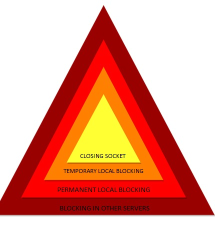

# Serverus
Serverus is an behavior-based intrusion detection and prevention system for linux-based servers which uses deep learning model in order to identify attacks by anomaly behavior on the server transportation and block it. 

The name "Serverus" is influenced by the great Cerberus from the greek mythology. A Cerberus (often referred to as the hound of Hades) is a creature which resembles to a multi-headed dog, and guards the gates of the Underworld. Since our product's main goal is defending servers from attack, we've found it exteremely similar to the Cerberus.  

Created by *Ofir Shapira* and *Omri Zaiman* as a final project of Magshimim - the Israeli national cyber program. 

## Table of contents
- [Serverus](#serverus)
  * [Table of contents](#table-of-contents)
  * [Installation](#installation)
    + [Requirements](#requirements)
      - [Linux software](#linux-software)
      - [Python modules](#python-modules)
    + [Compile](#compile)
  * [Main components](#main-components)
    + [Sniffing unit](#sniffing-unit)
    + [Model component](#model-component)
    + [Defending unit](#defending-unit)
    + [Server component](#server-component)
  * [Examples](#examples)
  * [Credits](#credits)


## Installation
First you have to register to our website [here](http://defence.rocks/), it will provide you the project files with a uniqe identifier that was generated especially for you by us. 

### Requirements
Make sure you have the following technologies installed on your machine:
#### Linux software
- [ZeroMQ](https://zeromq.org/download/) 
#### Python modules
- [scapy](https://pypi.org/project/scapy/) (for sniffing) --> `sudo pip install scapy`
- [pika](https://pypi.org/project/pika/) (for message queue) --> `sudo pip install pika`

It is also possible to install the modules using `requirements.txt` file <br><br>
`sudo pip3 install -r requirements.txt`

### Compile
For Compiling there are 2 main options:
- using `build.sh` - script that compiles and executes the project (on us, without a charge)
- compile by yourself
```
mkdir build
cmake -B build   #generate the make file
cd build
make .   #compile the project
sudo ./idps   #execute the script
``` 
## Main Components

### Sniffing Component
The Sniffing unit is a sniffer-like python program.
It uses Scapy module for packets' sniffing, and sends the packets to the model using messages queue.

### Model Component
The model component (implemented in C++ language) is based on an ensemble of autoencoders. It analyzes metadata (jitter and packets' size) and determines whether each packet is considered an anomaly with respect to the server's normal behaviour.
The model will output a score between [0-4] whereas 0 is a normal behavior.

#### Feature extractor (FE)
The feature extractor generates a vector of statistics from each new arriving packet. It uses statistics such as weight, mean, standard deviation, magnitude, radius, covariance, and correlation.
The FE uses Damped Incremental Statistics as a method of feature generating. 

#### Feature mapper (FM)
*describe

#### Anomaly detector (AD)
The anomaly detector is the part which is based on an ensemble of autoencoders. It composed of 2 layers of autoencoders:
* 1st --> the ensemble, each autoencoder receives a cluster from the Feature Mapper, and produces an RMSE (Root Mean Squared Error).
* 2nd --> the output layer, recieves the 1st layer's autoencoders' outputs (RMSEs) and produces an anomaly score for the specific packet given. 

Than, it manipulates the anomaly score into a number between [0-4], represents the blocking level for the packet's sender.


*add an image describing the parts

### Defending Component
The defending component communicates with the model and the server,<br> it will block an hostile entities according 
to the anomaly level the model provided:
1. Closing socket.
2. Blocking entity temporaly.
3. Blocking entity permanently.
4. Inform other machines (which uses Serverus) about the hostile entity. 

The blocking is made using linux `iptables` and requires a root permission.

<p align="center">
  
</p>

### Server component
The server component is responsible for supplying data to the database (all data which is not related to the web application). The defender on each machine sends data to the server, this data describes the events that the specific machine has encountered with (those events are considered as attacks). The server documents the events in the database. 
Moreover, the server is responsible for informing each defending unit about `level 4` events that another defenders has reported on. 

### Web application
Our web application [here](http://defence.rocks/), was built using `Flask` module in python language. it uses `Nginx` and `Gunicorn` in order to run in production. 
The app was developed with many tools to make the website accessible, such as: `Chart.js`, `bootstrap`, etc...

In order to use our services, one has to sign up to the website. As a registered user, a zip file containing the product's file becomes availiable.

## Examples
todo

## Credits
We would like to thank:
- Our Mentor [Shlomo Yona](https://www.mathematic.ai/).
- Our team leader Arad Kotzer.
- Yisroel Mirsky for his algorithm "[Kitnet](https://github.com/ymirsky/Kitsune-py)".


